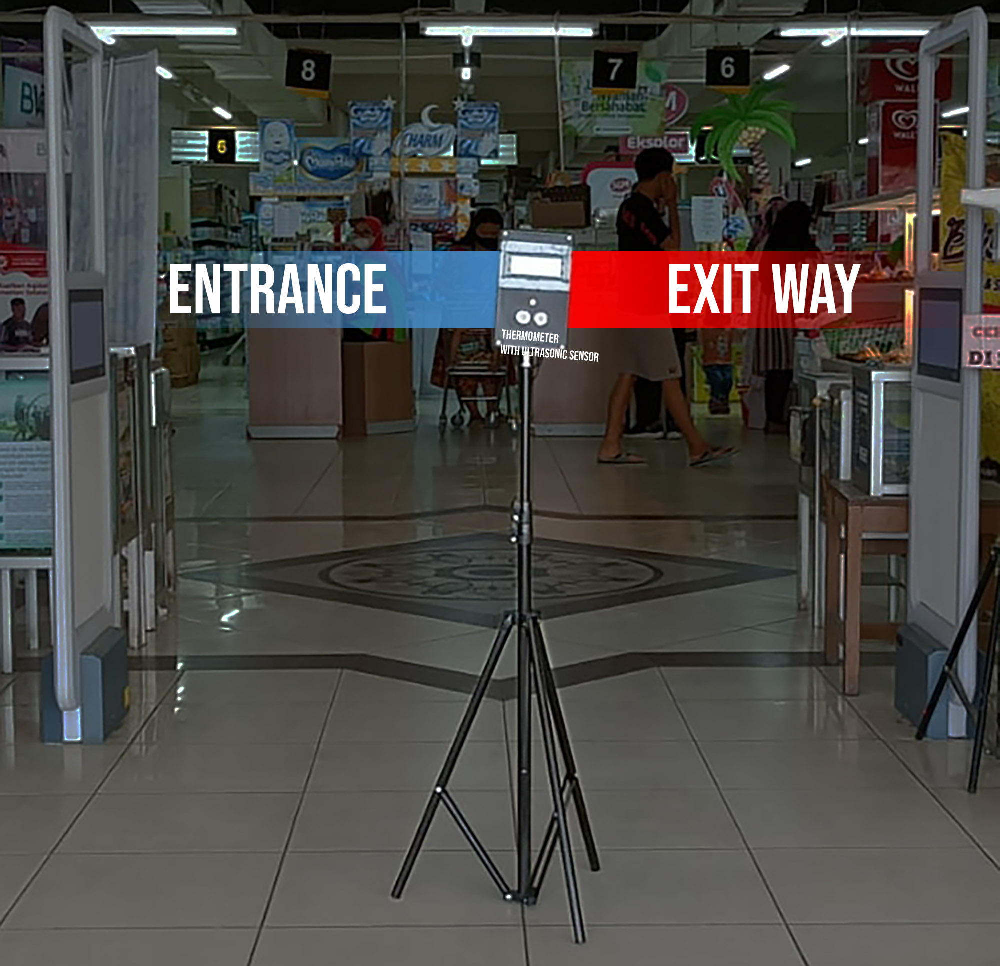
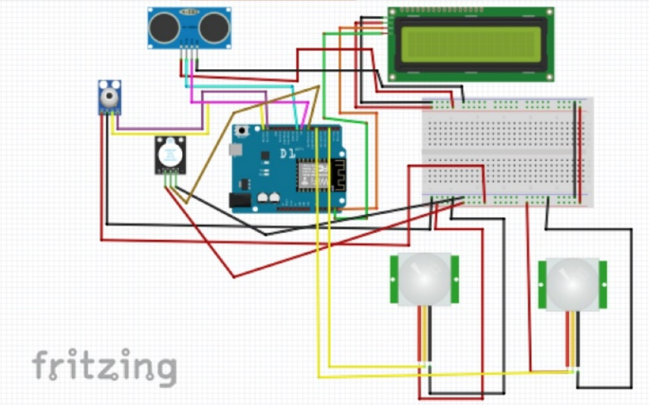

# Arduino <> Firebase <> Android

## summary
| Category | Unit |
| ------------- | ------------- |
| MCU  | Wemos D1  |
| Sensors | PIR SR602, IR MLX90614, Ultrasonic HC SR04 |
| Output | LCD 20x4 I2C |
| Cloud | Firebase Realtime Database |

## installation
- create project on firebase
- configure your Realtime Database
- download `google-services.json` from your firebase project
- put `google-services.json` to `app/` directory, or connect your app to firebase with android studio
- edit `FIREBASE_HOST`,`FIREBASE_AUTH`,`WIFI_SSID`,`WIFI_PASSWORD` in [iot.ino](iot.ino)
- build your APK

## demo


## scheme


## firebase realtime database
```json
{
  "Data": {
    "keluar": 13,
    "masuk": 18,
    "total": 5
  },
  "Suhu": [
    {
      "suhu": 35.05001
    },
    {
      "suhu": 34.96999
    }
  ]
}
```

## contributors
Muhammad Humam Zaky, Reza Daffa, Yoga Indra Wijaya
